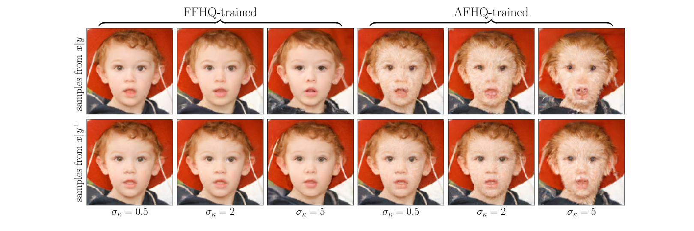

Code for the paper "Bayesian model selection and misspecification testing in imaging inverse problems only from noisy and partial measurements".

The code was executed using python 3.12.8, torch 2.6.0 and deepinv 0.3.3.

## Abstract

Modern imaging techniques heavily rely on Bayesian statistical models to address difficult image reconstruction and restoration tasks. This paper addresses the objective evaluation of such models in settings where ground truth is unavailable, with a focus on model selection and misspecification diagnosis. Existing unsupervised model evaluation methods are often unsuitable for computational imaging due to their high computational cost and incompatibility with modern image priors defined implicitly via machine learning models. We herein propose a general methodology for unsupervised model selection and misspecification detection in Bayesian imaging sciences, based on a novel combination of Bayesian cross-validation and data fission, a randomized measurement splitting technique. The approach is compatible with any Bayesian imaging sampler, including diffusion and plug-and-play samplers. We demonstrate the methodology through experiments involving various scoring rules and types of model misspecification, where we achieve excellent selection and detection accuracy with a low computational cost.




## Datasets

The datasets (except for the MRI scans which are extracted from FMRI) are available at https://zenodo.org/records/17484892 and should be put in the datasets directory. We use images from FFHQ [1], AFHQ [2], CelebA-HQ [3], LSUN-Bedrooms [4], Met-Faces [5], CBSD68 [6], and Fast-MRI [7, 8].

## Models

The models used in each experiment are available at https://zenodo.org/records/17484892 and should be put in:
- models (for kernel selection experiments)
- models/diffusion (for OOD detection experiments).

The GSDRUnet grayscale weights can be downloaded using deepinv.

The FFHQ and AFHQ trained models come from [9]: https://github.com/jychoi118/ilvr_adm

The MRI models, as well as the code contained in torch_utils
come from [10] https://github.com/wustl-cig/Measurement-domain-KL-divergence


## Kernel selection experiments

Use kernel_comparison.py to launch kernel selection experiments:
```
python3 kernel_comparison.py i 0 2
```
computes the samples for the 2 test images, for the ground truth kernel number i.

The notebook kernel_comparison.ipynb can then be used to evaluate the kernel selection accuracy using the saved samples.

kernel_comparison_reconstruction.ipynb can be used to compute the likelihood on MAP to compare to our method.
kernel_comparison_SAPG.py is used to fit the regularization parameter for each kernel/test image.

## OOD detection experiments

Use compute_samples_natural.py to generate samples for prior misspecification testing on natural images, and compute_samples_mri.py for MRI experiments:
```
python3 compute_samples_natural.py "results/diffusion/natural/FFHQ_FFHQ_05" 0 74
```
to compute the samples indexed 0 to 74 for the experiment described in "results/diffusion/natural/FFHQ_FFHQ_05/config.json". The samples are saved in the same directory as the config file.
The samples can then be post-processed using OOD_detection.ipynb to compute the metrics.

## Gaussian Analytical case

The analytical test cases are implemented in test_evaluation.py.

## References

[1] Tero Karras, Samuli Laine, and Timo Aila.
A style-based generator architecture for generative adversarial networks. In Proceedings of the
IEEE/CVF conference on computer vision and
pattern recognition, pages 4401–4410, 2019.

[2] Yunjey Choi, Youngjung Uh, Jaejun Yoo, and
Jung-Woo Ha. Stargan v2: Diverse image synthesis for multiple domains. In Proceedings of the
IEEE/CVF conference on computer vision and
pattern recognition, pages 8188–8197, 2020.

[3] Tero Karras, Samuli Laine, and Timo Aila.
A style-based generator architecture for generative adversarial networks. In Proceedings of the
IEEE/CVF conference on computer vision and
pattern recognition, pages 4401–4410, 2019.

[4] Fisher Yu, Ari Seff, Yinda Zhang, Shuran Song,
Thomas Funkhouser, and Jianxiong Xiao. Lsun:
Construction of a large-scale image dataset using
deep learning with humans in the loop. arXiv
preprint arXiv:1506.03365, 2015.

[5] Tero Karras, Miika Aittala, Janne Hellsten,
Samuli Laine, Jaakko Lehtinen, and Timo Aila.
Training generative adversarial networks with
limited data. Advances in neural information processing systems, 33:12104–12114, 2020.

[6] D. Martin, C. Fowlkes, D. Tal, and J. Malik. A
database of human segmented natural images and
its application to evaluating segmentation algorithms and measuring ecological statistics. In
Proceedings Eighth IEEE International Conference on Computer Vision. ICCV 2001, volume 2,
pages 416–423 vol.2, 2001

[7] Florian Knoll, Jure Zbontar, Anuroop Sriram,
Matthew J Muckley, Mary Bruno, Aaron Defazio,
Marc Parente, Krzysztof J Geras, Joe Katsnelson, Hersh Chandarana, et al. fastmri: A publicly available raw k-space and dicom dataset of
knee images for accelerated mr image reconstruction using machine learning. Radiology: Artificial
Intelligence, 2(1):e190007, 2020.

[8] Jure Zbontar, Florian Knoll, Anuroop Sriram,
Tullie Murrell, Zhengnan Huang, Matthew J
Muckley, Aaron Defazio, Ruben Stern, Patricia Johnson, Mary Bruno, et al. fastmri: An
open dataset and benchmarks for accelerated mri.
arXiv preprint arXiv:1811.08839, 2018.

[9] Jooyoung Choi, Sungwon Kim, Yonghyun Jeong,
Youngjune Gwon, and Sungroh Yoon. Ilvr: Conditioning method for denoising diffusion probabilistic models. In Proceedings of the IEEE/CVF
International Conference on Computer Vision,
pages 14367–14376, 2021.

[10] Shirin Shoushtari, Edward P Chandler, Yuanhao
Wang, M Salman Asif, and Ulugbek S Kamilov.
Unsupervised detection of distribution shift in
inverse problems using diffusion models. arXiv
preprint arXiv:2505.11482, 2025.